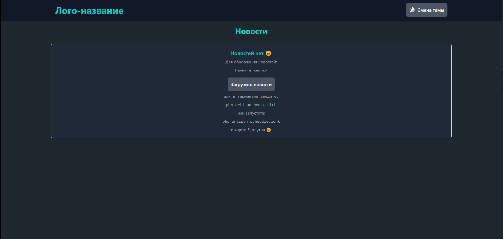
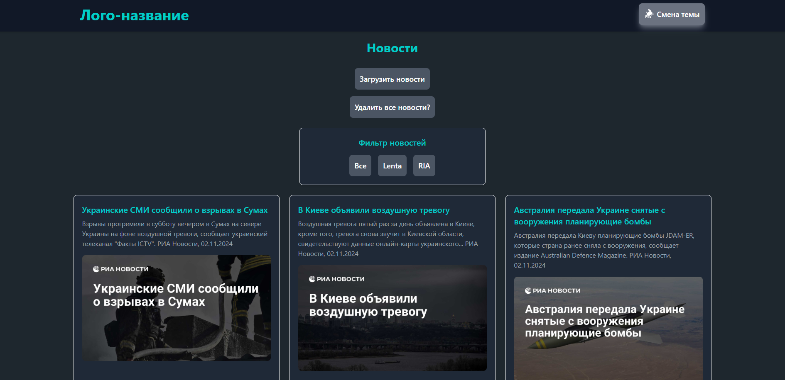

# Zatulin-Task-Parsing-V2

[](https://laravel.com)
[](https://php.net)
[](https://livewire.laravel.com)

## 📝 Описание

Система агрегации новостей с поддержкой асинхронной загрузки и автоматического обновления контента.




## 🚀 Возможности

- ⚡ Асинхронная загрузка новостей
- 🔄 Автоматическое обновление контента
- 📱 Адаптивный дизайн
- 🔍 Фильтрация по источникам
- 🗑️ Soft Delete с возможностью восстановления
- 📊 Детальная статистика

## 🛠 Установка

### Быстрая установка

```bash
# Клонирование репозитория
git clone https://github.com/kriher50/Zatulin-Task-Parsing-V2.git
cd Zatulin-Task-Parsing-V2

# Установка зависимостей
composer install

# Копирование файла конфигурации
cp .env.example .env

# Генерация ключа приложения
php artisan key:generate

# Настройка базы данных в файле .env
# DB_CONNECTION=mysql
# DB_HOST=127.0.0.1
# DB_PORT=3306
# DB_DATABASE=your_database_name
# DB_USERNAME=root
# DB_PASSWORD=

# Выполнение миграций
php artisan migrate

# Установка Node.js зависимостей
npm install
# Для автоматического исправления Уязвимости.
npm audit fix

# Сборка фронтенд-ресурсов
npm run build

# Запуск очередей (в отдельном терминале)
php artisan queue:work

# Запуск планировщика задач (в отдельном терминале)
php artisan schedule:work

# Запуск сервера разработки
php artisan serve
```

## 🧪 Тестирование

```bash
# Создание тестовой базы данных
php artisan db:create --env=testing

# Выполнение миграций для тестовой базы данных
php artisan migrate --env=testing

# Запуск всех тестов
php artisan test

# Запуск тестов с подробным выводом
php artisan test --verbose

# Запуск конкретного теста
php artisan test --filter=TestName

# Запуск тестов с покрытием кода (требуется Xdebug)
php artisan test --coverage

# Запуск тестов определенного модуля
php artisan test --testsuite=Feature
php artisan test --testsuite=Unit

# Очистка кэша перед тестированием
php artisan config:clear
php artisan cache:clear
php artisan test
```
